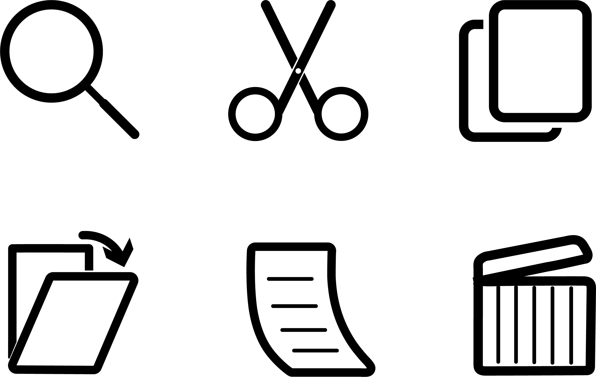
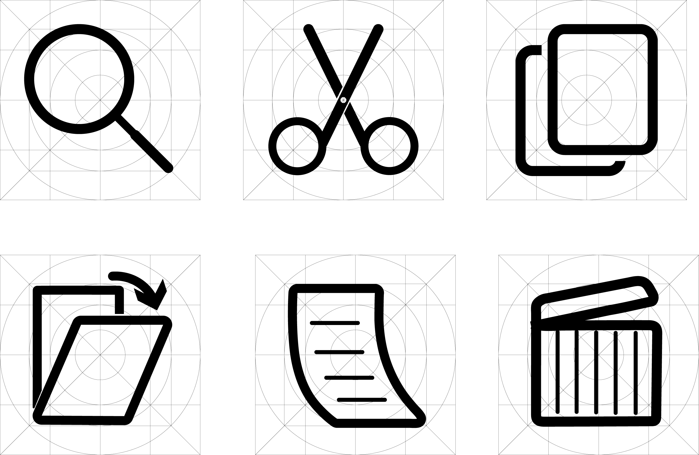
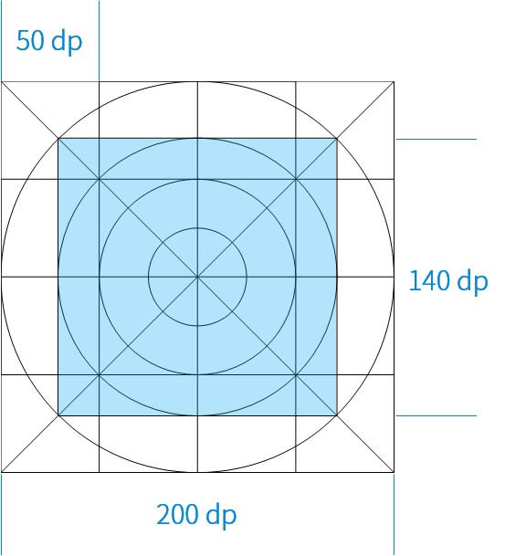
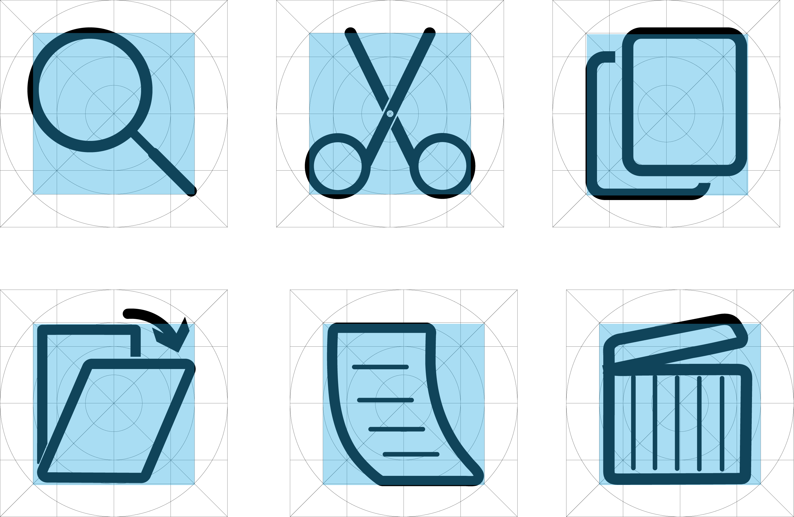

# HCI第一次作业

  

--------
## 1. 设计结果
### [图标 :](icon/2.png)

### [ppt](icon/icon.pptx)
### [ai原文档](icon/icon.ai)

## 2. 设计思路
### 1) 设计目的
这六个图标的设计目的是用于 Material Design 风格的 app 的系统图标, 因此在设计时参考了 Material Design 的设计语言与规范.
### 2) 设计原则
#### a. 简洁
>图标应在能表达本意的前提下仅可能的精简

因此图标的设计元素选择了二维的几何图形, 尽量减少不必要元素给使用者带来的视觉干扰, 并保证了在低分辨率下一定的可读性.
在颜色的选用上, 图标使用同一种纯色进行表达. 除此之外, 纯色的系统图标可以根据 app 的主题进行颜色的改变, 避免更改主题后图标颜色的违和感与突兀感.

#### b. 现代化
>使用图标网格促进图标的一致性，并建立清晰的规范。

图标设计有明确的规范, 保证风格与大小上的统一. 

#### c. 友好
>确保即使在小尺寸下也有很好的可读性和清晰度, 并有一定的趣味. 

#### 设计约束
因此, 在设计时使用以像素为单位的网格, 在 200dp 的大小范围内进行设计.

在设计时使用 140dp 大小的安全区域. 使图标内容保持在安全区域内。在安全区域内，图标有足够的显示空间，不会被视图截断（例如滚动时出现的侧边栏）。

##### 不过很少的一部分处于安全区域外也是允许的 :

### 3. 互评
5分
*from*  1751174 ** 1750981 **

